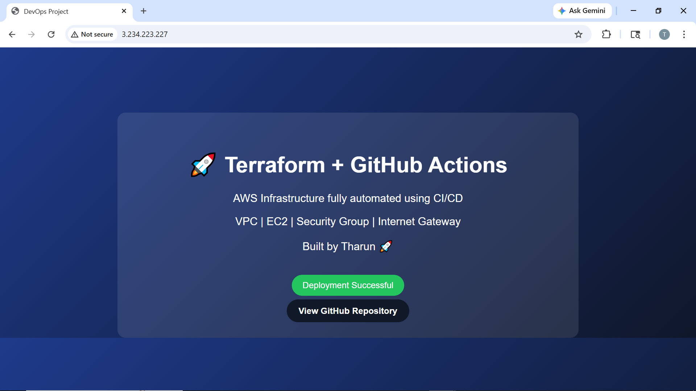
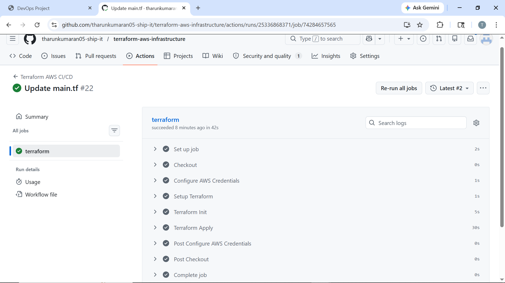
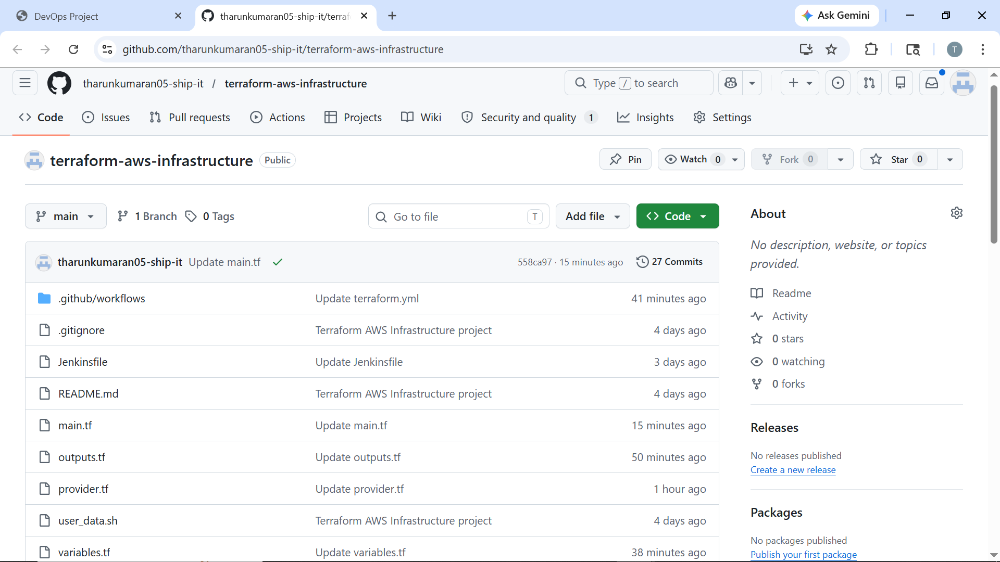
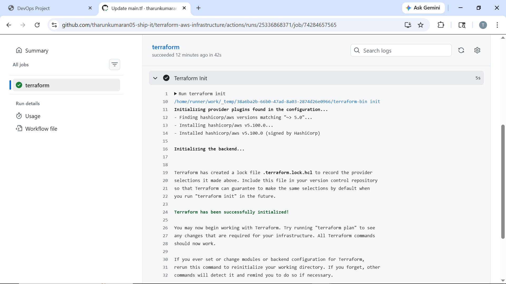
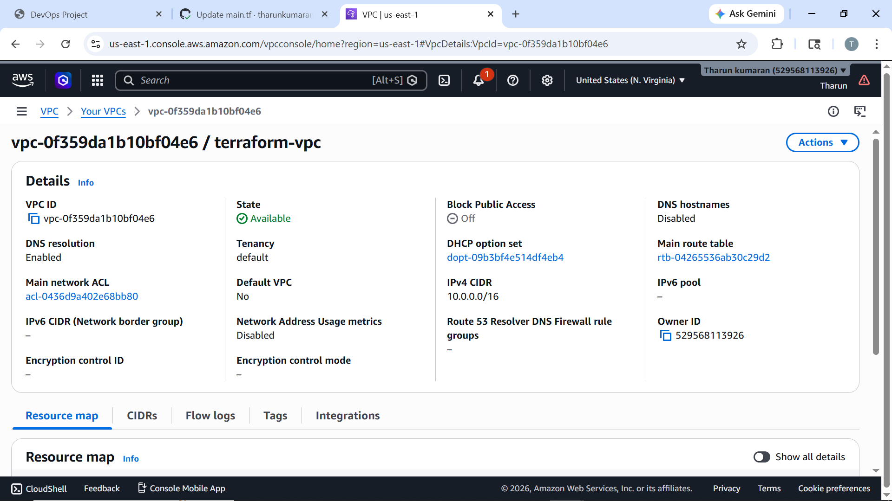
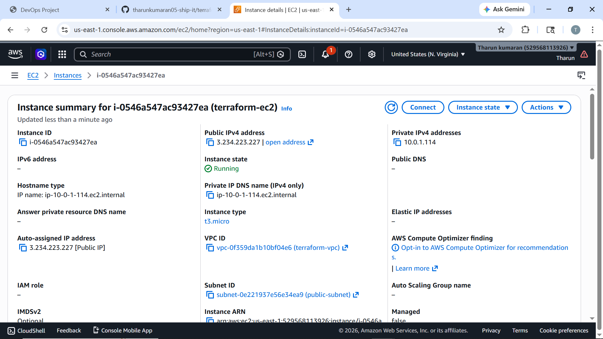
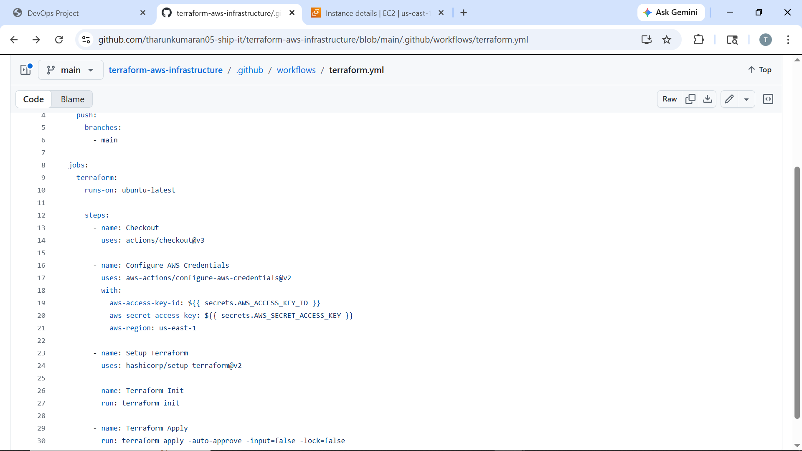

# 🚀 Terraform + GitHub Actions CI/CD Project

## 📌 Overview
This project demonstrates an end-to-end DevOps workflow using **Terraform and GitHub Actions** to automate AWS infrastructure deployment.

---

## 🏗️ Architecture
- VPC
- Public Subnet
- Internet Gateway
- Route Table
- Security Group
- EC2 Instance
- Apache Web Server

---

## ⚙️ Technologies Used
- Terraform
- AWS EC2
- AWS VPC
- GitHub Actions
- Linux User Data
- Apache HTTP Server

---

## 🔄 CI/CD Workflow
1. Code is pushed to GitHub
2. GitHub Actions workflow starts automatically
3. AWS credentials are loaded securely using GitHub Secrets
4. Terraform initializes providers
5. Terraform provisions AWS infrastructure
6. EC2 instance deploys the web page automatically using user data

---

## 🌐 Live Website Output

---

## ⚡ GitHub Actions Pipeline Success

---

## 📁 Repository Structure

---

## 🧠 Terraform Initialization

---

## 🌍 AWS Infrastructure

### VPC Created Using Terraform

### EC2 Instance Running

---

## 🔧 GitHub Actions Workflow

---

## ✅ Key Features
- Automated AWS infrastructure provisioning
- CI/CD pipeline using GitHub Actions
- Secure AWS authentication using GitHub Secrets
- EC2 web server deployment using Terraform `user_data`
- Repeatable and scalable infrastructure setup

---

## 📌 Project Outcome
This project successfully provisions AWS infrastructure and deploys a web application automatically using Terraform and GitHub Actions.

---

## 👨‍💻 Author
**Tharun**
